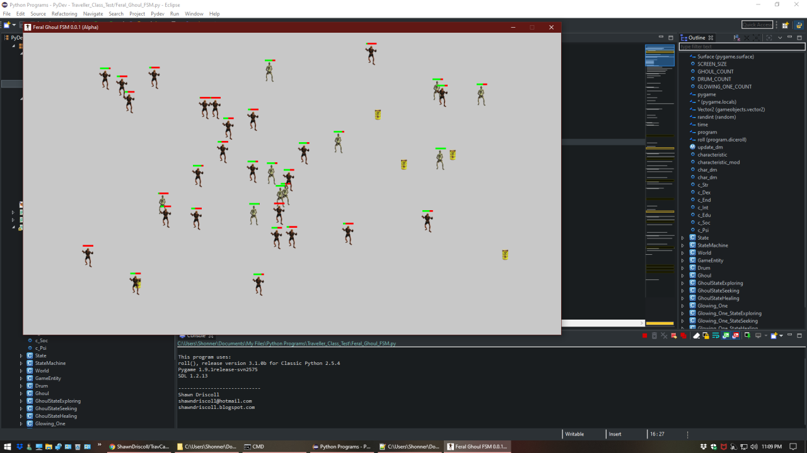

**Feral Ghoul FSM 0.0.1a**
==========================

**Feral Ghoul FSM 0.0.1a** is a **Classic Python 2.5** finite-state machine for modeling the behaviors of feral ghouls from Fallout 3 using NPC characteristics and modifiers from the Traveller RPG. The ghouls are spawned in an injured state and will look for ways to heal themselves.

Notes
-----

**Feral Ghoul FSM 0.0.1a** has been tested already on Windows XP/7/10. For the library code imported into this program, you will need the book titled: Beginning Game Development with Python and Pygame 1st Edition, by Will McGugan.

The Traveller game in all forms is owned by Far Future Enterprises. Copyright 1977 - 2020 Far Future Enterprises. Traveller is a registered trademark of Far Future Enterprises.

Contact
-------
Questions? Please contact shawndriscoll@hotmail.com
